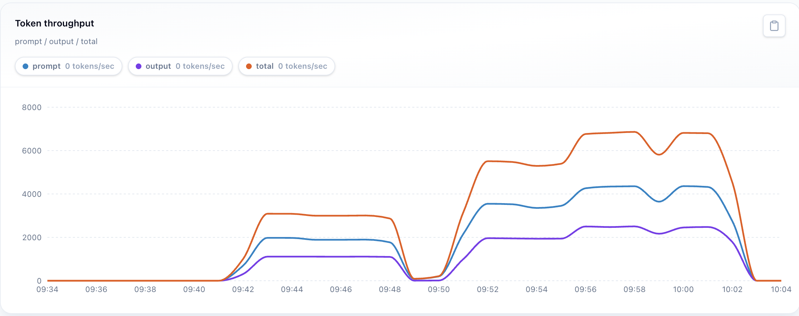
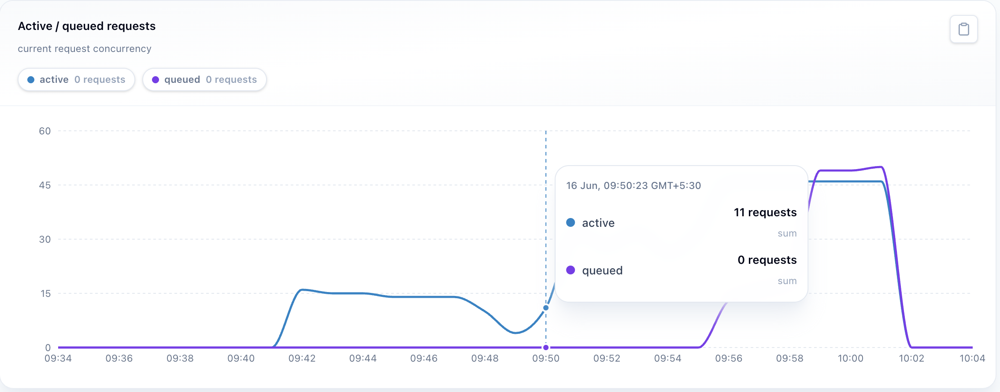
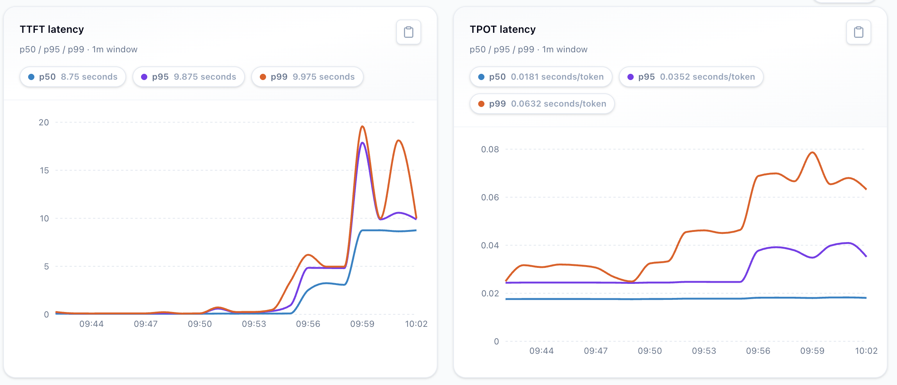
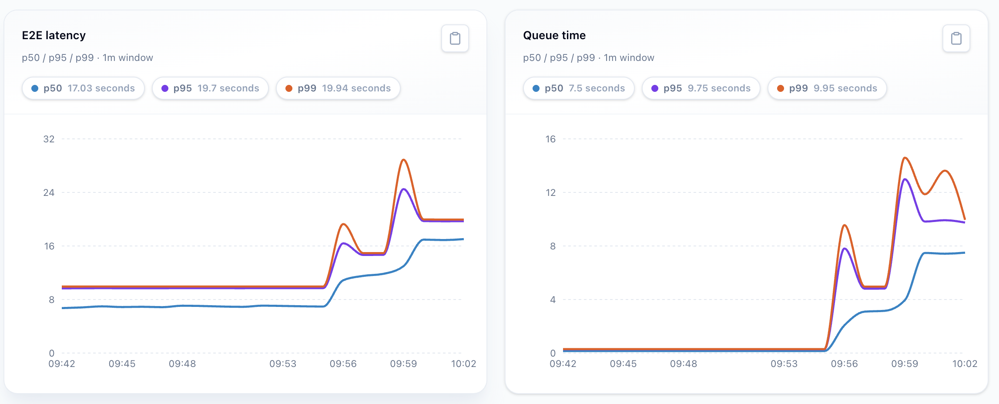

# [Benchmark] 1× RTX 5090 · Qwen3.5-9B · BF16 · vLLM — 1280 tok/s peak, TTFT 0.7s → 18s across concurrency 16–128 (ShareGPT)

We benchmarked **Qwen3.5-9B BF16** on **1× RTX 5090** with our custom harness using the
real-world **ShareGPT** dataset. Engine: **vLLM 0.19**. Companion SGLang run on identical
hardware: [`rtx5090-qwen3.5-9b-bf16-sglang.md`](rtx5090-qwen3.5-9b-bf16-sglang.md).

## TL;DR

Clean ceiling: throughput climbs nicely up to **concurrency 64 (~1,280 output tok/s)**
and then stops. Concurrency 128 gives basically the same throughput but nearly doubles
end-to-end latency and triples time-to-first-token (**5.7s → 17.9s p95**). Past 64,
the GPU isn't doing more work — requests just wait longer in the queue.

## Model

| | |
|---|---|
| Model | Qwen3.5-9B |
| HF path | `Qwen/Qwen3.5-9B` |
| Quantization / dtype | BF16 |
| Context length configured | 4096 max-tokens |

## Serving

| | |
|---|---|
| Engine | vLLM 0.19 |
| CUDA | 13.0.1 |
| Endpoint | `/v1/chat/completions` |

Engine flags:

```json
{"enable_auto_tool_choice": true, "exclude_tools_when_tool_choice_none": true,
 "tool_call_parser": "qwen3_coder", "dtype": "bfloat16", "max_model_len": 4098,
 "served_model_name": ["Qwen/Qwen3.5-9B"], "generation_config": "vllm",
 "gpu_memory_utilization": 0.9, "enable_prefix_caching": true,
 "language_model_only": true, "max_num_batched_tokens": 4096,
 "enable_chunked_prefill": true}
```

## Hardware

| | |
|---|---|
| GPU | 1× RTX 5090 |
| VRAM | 32GB |
| CPU | 48 vCPU |
| RAM | 177 GB |

## Workload

| | |
|---|---|
| Dataset | ShareGPT sample — 1080 unique prompts × 4 concurrency settings = 4320 prompts |
| Conversation shape | Multi-turn, one response per request |
| Languages | Multilingual (en/zh/ru/th/ko/fr/pl/ja) |
| max_model_len | 4098 |
| max_tokens per completion | 256 |
| temperature | 0.2 |

## Methodology

| | |
|---|---|
| Load tool | Custom harness (being open-sourced soon) |
| Concurrency levels | 16, 32, 64, 128 |
| Streaming | ON |

Full protocol: [`METHODOLOGY.md`](../METHODOLOGY.md).

## Metrics

| Concurrency | Requests | Output tok/s | E2E p95 | TTFT p95 |
|---|---|---|---|---|
| 16 | 1080 | 444.4 | 7.48s | 0.70s |
| 32 | 1080 | 999.9 | 8.55s | 0.99s |
| **64** | 1080 | **1279.2** | 14.59s | 5.68s |
| 128 | 1080 | 1253.3 | 27.01s | 17.92s |

## Charts






Run executed 09:41 → 10:01, sweeping 16 → 32 → 64 → 128. Performance flattened after 64.

## Takeaways & caveats

- Single-environment result (RTX 5090, vLLM 0.19). **Pin the engine version in your setup** — newer
  vLLM releases can shift these numbers materially.
- The useful operating point here is **concurrency 64**: peak throughput before
  latency/TTFT blow up. Past it you trade responsiveness for nothing.
- Measures serving performance, not output quality.

---

*Part of [Open LLM Inference Benchmarks](../README.md) by [HexGrid](https://hexgrid.cloud).*
